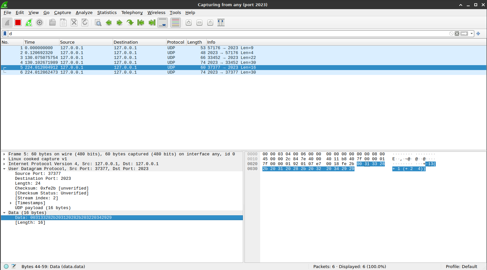
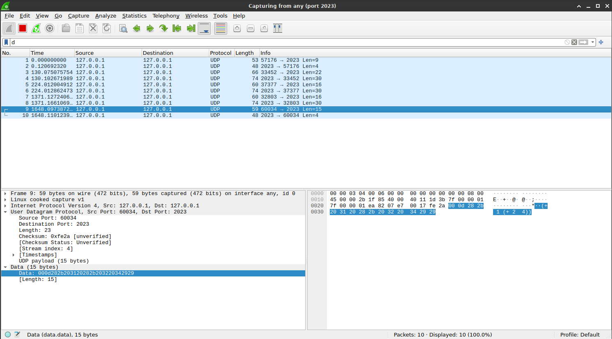

# IPK (Počítačové komunikace a sítě) - Task 1

Evaluation: Not known yet

## Assignment

In files Protocol.md and Assignment.md.

## Documentation

### Základní teorie

Program komunikuje se serverem pomocí UDP nebo TCP. To jsou jedny z hlavních síťových komunikačních protokolů.
TCP komunikace je spolehlivá. Jedny z nejdůležitějsích znaků spolehlivé komunikace (TCP) je zajištění doručení paketu nebo zachování pořadí odeslaných bytů. Spolehlivost komunikace TCP zajišťuje větší režií přenosu (například je pro komunikaci potřeba na začátku navázat spojení).
UDP komunikace je narozdíl od TCP nespolehlivá. Protokolem není tedy zajištěno doručení paketů a ani jejich správné pořadí. Pro přenos dat UDP používá diagramy, jejichž součástí je jen základní bitová kontrola detekující bitové inverze dat. Nespolehlivost komunikace je částečně vyvážena nízkou režií přenosu (například není potřeba na začátku navazovat spojení).
Základní informace pro zdárnou komunikaci pomocí těchto protokolů je IP adresa (identifikace zařízení v síti) a port (identifikace aplikace na daném zařízení). Tyto informace jsou předávány v parametrech skriptu. \[1\]

### Testování

Správná funkčnost skriptu byla testována ručně, tedy zadáním vstupu (či vložení souboru na vstup programu) a analýzou daného výstupu. Testování bylo prováděno na přiloženém virtuálním stroji (pomocí nástroje VirtualBox), byl tedy použit referenční server s odpovídajícími parametry. Pro testování funkcionality komunikace byl použit příkaz `./ipkcpc -h 127.0.0.1 -p 2023` s dalším parametrem pro upřesnění módu komunikace (`-m tcp` nebo `-m udp`).

#### Vstupní parametry programu

V první fázi se testovalo zpracování parametrů. Program podporuje pevně daný počet (6) parametrů programu v různém pořadí, což bylo řádně otestováno. Program správně zpracoval například tyto vstupy (různě zpřeházené parametry):

```
./ipkcpc -m udp -p 2023 -h 127.0.0.1
./ipkcpc -p 2023 -h 127.0.0.1 -m tcp
```

#### Základní implementace funkcí pro řízení komunikace 

U většiny kritických funkcí pro řízení komunikace (přiřazení socketu, navázání komunikace, odeslání a příjem dat, překlad adresy ze vstupního řetězce) je v programu kontrolována jejich návratová hodnota. Při neočekávané návratové hodnotě se vypisuje chybová zpráva na standardní chybový výstup. Byly tak rychle odhaleny implementační chyby špatného předávání parametrů těchto funkcí. 
Chybová zpráva je vypsána i v případě nevalidního vstupu IP adresy (program podporuje jen číselné IPv4 adresy). Při chybném tvaru IPv4 adresy předaného v parametru programu například `-h 127.0.000` nebo `-h adresa` je vypsána následující chybová zpráva (inet_pton - funkce pro překlad IPv4 adresy):

```
ERROR: inet_pton: Invalid address
```

#### TCP komunikace

Při testování TCP přenosu byl server spuštěn příkazem `ipkpd`. Dále jsou příklady použitých testů pro TCP komunikaci. Všechny tyto testy prošli.

1. Validní příklad komunikace ze zadání
	
	vstup:
	```
	HELLO
	SOLVE (+ 1 2)
	BYE
	```
	
	výstup:
	```
	HELLO
	RESULT 3
	BYE
	```

2. Validní příklad s několika složitějšími příkazy SOLVE
	-  IPKCP podporuje více SOLVE příkazů, vnořené operace a také několik operandů jedné operace
	
	vstup:
	```
	HELLO
	SOLVE (+ 2 (/ (* 2 6) 3))
	SOLVE (- 7 6)
	SOLVE (+ 3 6 7 8)
	BYE
	```
	
	výstup:
	```
	HELLO
	RESULT 6
	RESULT 1
	RESULT 24
	BYE
	```

3. Nevalidní neznámé příkazy
	- server nerozpozná tyto příkazy, pošle `BYE` zprávu a ukončí komunikaci
	
	vstup:
	```
	HELL
	```
	
	výstup:
	```
	BYE
	```
	
	vstup:
	```
	SOLVE (a b)
	```
	
	výstup:
	```
	BYE
	```
	
	vstup:
	```
	HELLO
	GOODBYE
	```
	
	výstup:
	```
	HELLO
	BYE
	```

4. Nevalidní posloupnost příkazů
	- Není přítomen příkaz `HELLO`, který vždy zahajuje komunikaci, server tedy pošle přímo `BYE` zprávu
	
	vstup:
	```
	SOLVE (+ 1 2)
	```
	
	výstup:
	```
	BYE
	```

#### UDP komunikace

Při testování UDP přenosu byl server spuštěn příkazem `ipkpd -m udp`. Byly testovány stejné situace jako u TCP přenosu (v odpovídajícím formátu pro UDP).

#### Využití nástroje Wireshark

Při neočekávané reakci serveru byla komunikace analyzována pomocí nástroje Wireshark. Byly tak odhaleny a opraveny tyto chyby:
 - chybějící znak nového řádku na konci zprávy u TCP komunikace
 - chybný formát odesílané zprávy u UDP komunikace (viz níže screenshot nástroje Wireshark)

 Chybné posílání délky (payload length) jako řetězec:
 
 

Správné posílání délky jako 1 byte:



### Literatura

[1] VESELÝ, Vladimír. *IPK2023 - 04 - Transportní vrstva*. *IPK přednášky* \[online\]. Brno: Vysoké učení technické v Brně, Fakulta informačních technologií, 2023, 16-64 \[cit. 2023-03-20\].

### Literatura pro implementaci

Pro implementaci UDP a TCP komunikace byla využita 4. přednáška předmětu IPK:

DOLEJŠKA, Daniel a Michal KOUTENSKÝ. *IPK2023 - 03 - Programování síťových aplikací*. *IPK přednášky* \[online\]. Brno: Vysoké učení technické v Brně, Fakulta informačních technologií, 2023, 14-34 \[cit. 2023-03-17\].

Pro specifické funkce operačního systému Linux byl využit webový Linux manuál:

KERRISK, Michael. *Linux man pages online* \[online\]. 2023 \[cit. 2023-03-17\]. Dostupné z: https://man7.org/linux/man-pages/index.html

Pro C++ třídy a metody byla využita C++ referenční wiki:

WEBSITE COMMUNITY. *C++ reference* \[online\]. 2023 \[cit. 2023-03-20\]. Dostupné z: https://en.cppreference.com/w/